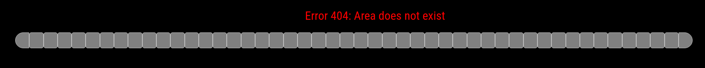

# MMM-EskomSePush

A [MagicMirror²](https://magicmirror.builders) module to display South African Loadshedding schedule using data from [EskomSePush](https://eskomsepush.gumroad.com/l/api).

[](https://MagicMirror.builders)
[](LICENSE)
[](https://eslint.org/)
[](https://prettier.io/)

## 2.5hr Stint


## 4.5hr Stint


## No Loadshedding


## Invalid Area



## Dependencies

- Requires MagicMirror² v2.23.0
- node-fetch v2.6.1
- luxon v3.4.2

## Installation

In your terminal, go to your MagicMirror's Module folder:

```
cd ~/MagicMirror/modules
```

Clone this repository:

```
git clone https://github.com/mumblebaj/MMM-EskomSePush.git
```

```
cd MMM-EskomSePush
npm install
```

Add the module to the modules array in the `config/config.js` file:

```javascript
        {
            module: "MMM-EskomSePush",
            position: "middle_center", //Works best at middle_center. May not display all that well in other positions
            disabled: false,
            config: {
              token: "your token",
              area: "yourarea",
              updateInterval: 30*60*1000,
              fetchInterval: 30*60*1000
            }
},
```

## Updates

### v1.2.8

- On request have added a config to hide all elements when there is no Loadshedding scheduled.
- New option `hideElements` have been added and can accept a value of `both`. This will auto hide the module content when there is no loadshedding. This config can be removed to show the current `No Loadshedding`.

### v1.2.7

- Updates to css to align better.
- add MagicMirror Platform license

### V1.2.4

- Updated module to show No upcoming loadshedding when there are no events for the scheduled stage.

### V1.2.2

- Updates to remove invalid extra 30 minutes from display
- With recent updates by City Power the current area code has been updated. Ensure latest area code is used if you live in the Johannesburg area.

## Registration for Token

Go to [EskomSePush](https://eskomsepush.gumroad.com/l/api) and register for a free account. This allows you 50 calls per day. Obtain your token and determine your area as both these are required as input into the module.

To Obtain your area you can run the collowing command from the command line:

```bash
curl --request GET --url https://developer.sepush.co.za/business/2.0/areas_search?text=your-area-goes-here --header 'token: your-espsepush-token-here'
```

- Replace `your-area-goes-here` with partial of your area
- Replace `your-espsepush-token-here` with your ESP Token

From the result set you can select the correct `id` for your area from the list.

```json
{
  "areas": [
    {
      "id": "jhbcitypower3-5-goldenharvestah",
      "name": "Golden Harvest A.H (5)",
      "region": "JHB City Power"
    },
    { "id": "jhbcitypower3-11-harveston", "name": "Harveston (11)", "region": "JHB City Power" }
  ]
}
```

## Updating

To update the module to the latest version, use your terminal to go to your MMM-EskomSePush module folder and type the following command:

```
cd MMM-EskomSePush
git pull
npm install

```
